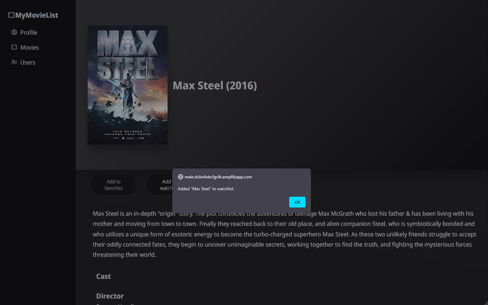
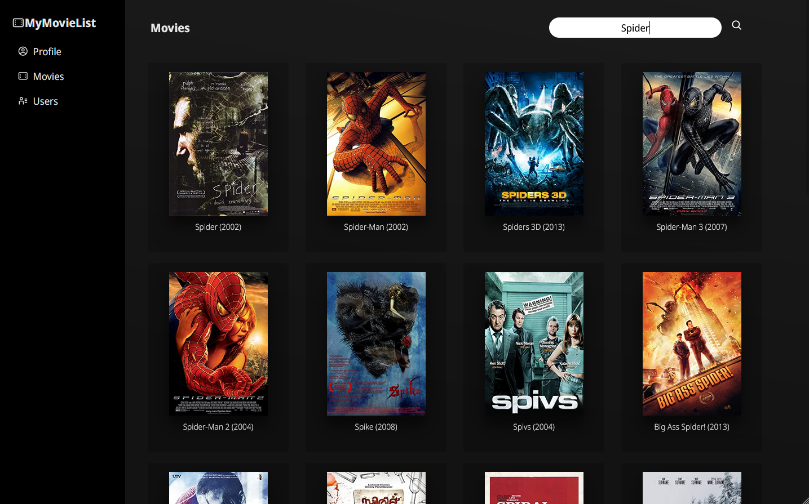
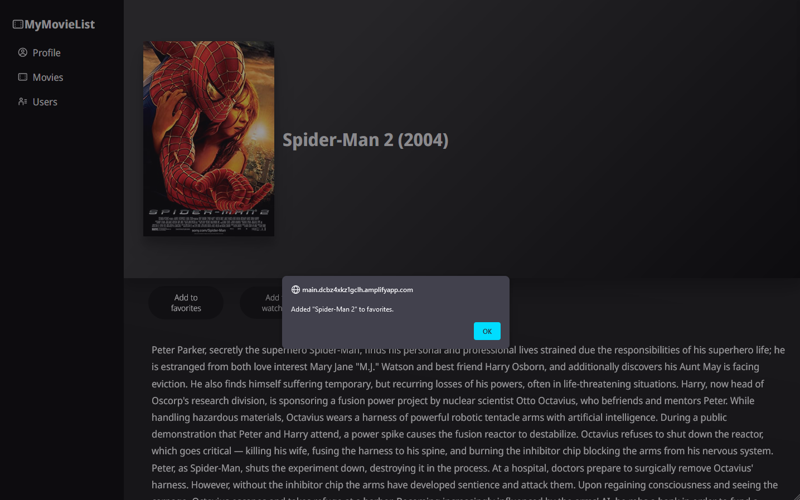
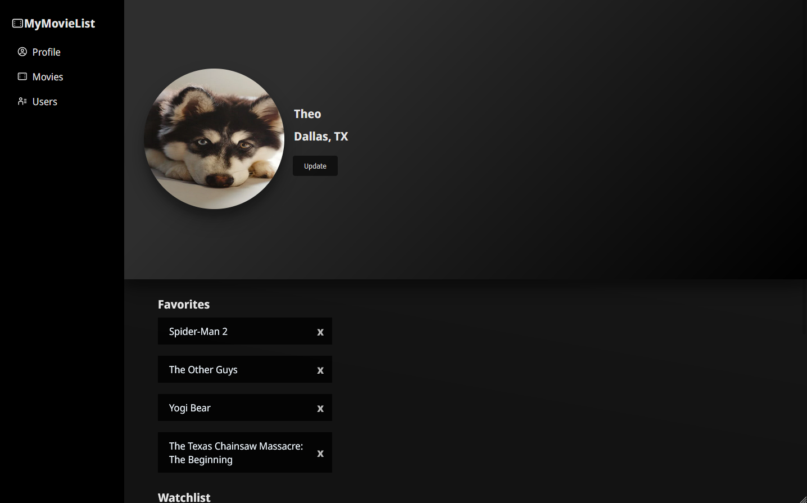

# MyMovieList

Browse, search, and add movies to a watch list. Features 34k+ movie titles from 1901 through 2017.

*This was a take home project for a job interview. I was not asked to make this application, specifically, but this was my interpretation of the assignment. Granted, I also took some creative libereties to satisfy my personal interests. I wanted to exercise my abilities to create a clean UI, so I challenged myself to create something inspired by Spotify. This application serves no greater purpose beyond the interview, practice, and as a portfolio piece.*

[Visit the live deployment](https://main.dcbz4xkz1gclh.amplifyapp.com/#/movie-list)

## Table of contents
- [Overview](#overview)
- [Technologies used](#technologies-used)
- [Screenshots](#screenshots)
  - [Desktop](#desktop)
  - [Mobile](#mobile)
 
## Overview

As stated above, this application's purpose was essentially to look cool and give me some practice. It does not serve a greater purpose. As for it's functionality, it allows users to search for movie information in a database and manage a watchlist for said information. When you visit the home page, a random selection of movie posters are displayed and the user can either click to read more about the movie or use the search bar at the top of the page to search for other movies. After clicking on a poster of a particular interest, the associated movie can be added to a watchlist.

A list of features include:
- Browse 30k+ movies.
- Search for movies, database returns up to 30 similar matches.
- App attempts to assign posters for each movie via third party API.
- View data and wiki for each movie.
- Add movies to watchlist, favorites, completed, and dropped categories for user profile.
- Remove movies from profile categories.
- Update name and location of profile.

## Technologies used
- React.js
- JavaScript (ES6)
- HTML
- CSS
- Python
- Pandas
- PostgreSQL
- AWS RDS
- AWS Lambda
- AWS Amplify

# Screenshots

## Desktop

# Landing page / Movie List view

# After clicking on a movie

# Adding movie to watchlist

# Landing page / Movie List view (after searching for "Spider")

# Spider Man 2 page

# Adding Spider Man 2 to favorites

# Visiting user profile

# Updating profile (name and location)

# Users page (user database is a future improvement)

## Mobile

# Landing page / Movie List view (mobile)

# After clicking on a movie (mobile)

