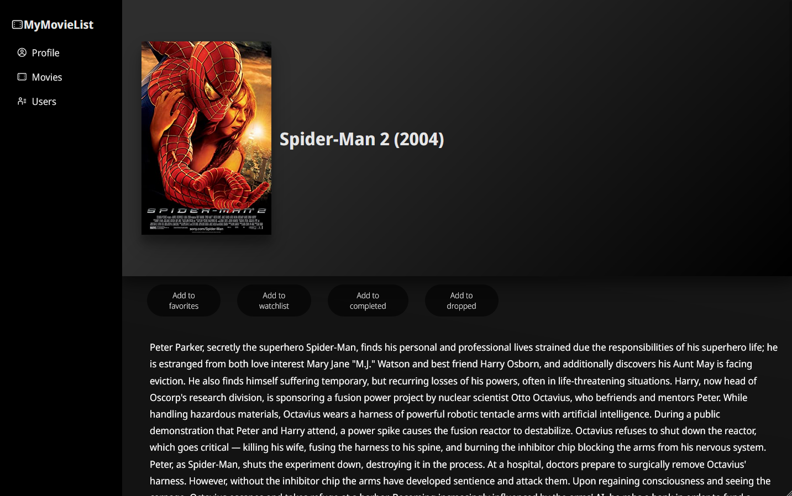

# MyMovieList

Browse, search, and add movies to a watch list. Features 34k+ movie titles from 1901 through 2017. 

### Hypothetical

What does your taste in movies say about you? No, this isn't a BuzzFeed article or an online quiz. 
MyMovieList is a platform for creating your own Movie Profile. Your profile can be used to express your exquisite taste
and find other people of a similarly refined palate.

### Deployment
https://main.dcbz4xkz1gclh.amplifyapp.com/#/movie-list

### Technologies used
- React.js
- JavaScript (ES6)
- HTML
- CSS
- Python
- Pandas
- PostgreSQL
- AWS RDS
- AWS Lambda
- AWS Amplify

### Features
- Browse 30k+ movies
- Search for movies, database returns up to 30 similar matches
- App attempts to assign posters for each movie via third party API
- View data and wiki for each movie
- Add movies to watchlist, favorites, completed, and dropped categories for user profile
- Remove movies from profile categories
- Update name and location of profile

### Future improvements
- Add testing suites
- Add plots to movie data
- Update banners so they change color based on poster and profile pic
- Add database for mock users

# Screenshots

# Landing page / Movie List view

# After clicking on a movie

# Adding movie to watchlist

# Landing page / Movie List view (after searching for "Spider")

# Spider Man 2 page

# Adding Spider Man 2 to favorites

# Visiting user profile

# Updating profile (name and location)

# Users page (user database is a future improvement)

